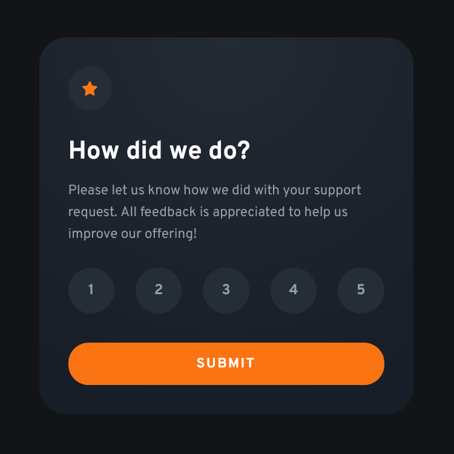

# Frontend Mentor - Interactive rating component solution

This is a solution to the [Interactive rating component challenge on Frontend Mentor](https://www.frontendmentor.io/challenges/interactive-rating-component-koxpeBUmI). Frontend Mentor challenges help you improve your coding skills by building realistic projects. 

## Table of contents

- [Overview](#overview)
  - [The challenge](#the-challenge)
  - [Screenshot](#screenshot)
  - [Links](#links)
- [My process](#my-process)
  - [Built with](#built-with)
  - [What I learned](#what-i-learned)
  - [Useful resources](#useful-resources)
- [Author](#author)

## Overview

### The challenge

Users should be able to:

- View the optimal layout for the app depending on their device's screen size
- See hover states for all interactive elements on the page
- Select and submit a number rating
- See the "Thank you" card state after submitting a rating

### Screenshot




### Links

- [Solution URL](https://www.frontendmentor.io/solutions/interactive-rating-component-using-css-grid-and-javascript-APQtGNXdeC)
- [Live Site URL](https://interactive-rating-component-zeta-rose.vercel.app/)

## My process

### Built with

- Semantic HTML5 markup
- CSS custom properties
- Flexbox
- CSS Grid
- Mobile-first workflow

### What I learned

I picked up this useful bit of code from Kevin Powell's excellent YouTube content. It's the first time I've used it in a project, and it worked great for stacking my input/label pairs.

July 2025 Updates
Moving through the Frontend Mentor Accessibility learning path and this is the first project to complete before moving forward. I'd completed this small component project about 2 years prior, so this was a good time to revisit. 

- Updated some of the styling to better match the comp
- Complete revision of the JavaScript code
- Use of the `template` element to dynamically render the two screens
- This is a good use case for a simple React component, but since I'd originally completed with vanilla JS, I wanted to adapt it by tinking with the existing JS...

```css
.stacked {
  display: grid;
  place-items: center; 
}

.stacked > * {
  grid-column: 1 / -1;
  grid-row: 1 / -1;
}
```

### Useful resources

- [moderncss.dev](https://www.moderncss.dev) - This series by Stephanie Eckles is indispensible when tackling accessibility and style concerns ranging from simple to advanced. I keep coming back to it over and over. For this project, the articles on custom styled radio buttons was particularly useful. 

## Author

- Website - [Matt Pahuta](https://www.mattpahuta.com)
- Frontend Mentor - [@mattpahuta](https://www.frontendmentor.io/profile/MattPahuta)
- Bluesky - [@mattpahuta](https://bsky.app/profile/mattpahuta.bsky.social)
- LinkedIn - [Matt Pahuta](www.linkedin.com/in/mattpahuta)

