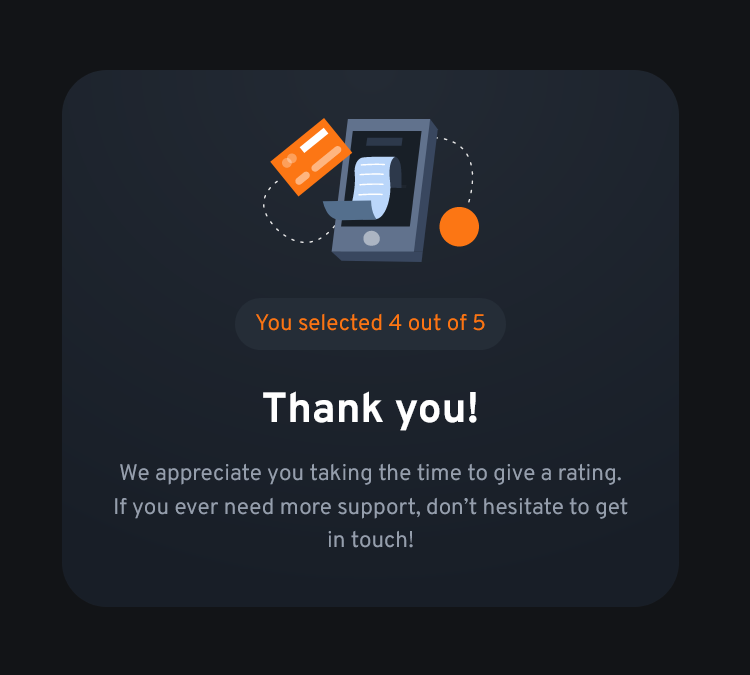

# Frontend Mentor - Interactive rating component solution

This is a solution to the [Interactive rating component challenge on Frontend Mentor](https://www.frontendmentor.io/challenges/interactive-rating-component-koxpeBUmI). Frontend Mentor challenges help you improve your coding skills by building realistic projects. 

## Table of contents

- [Overview](#overview)
  - [The challenge](#the-challenge)
  - [Screenshot](#screenshot)
  - [Links](#links)
- [My process](#my-process)
  - [Built with](#built-with)
  - [What I learned](#what-i-learned)
  - [Useful resources](#useful-resources)
- [Author](#author)

## Overview

### The challenge

Users should be able to:

- View the optimal layout for the app depending on their device's screen size
- See hover states for all interactive elements on the page
- Select and submit a number rating
- See the "Thank you" card state after submitting a rating

### Screenshot





### Links

- [Solution URL](https://www.frontendmentor.io/solutions/interactive-rating-component-using-css-grid-and-javascript-APQtGNXdeC)
- [Live Site URL](https://interactive-rating-component-zeta-rose.vercel.app/)

## My process

### Built with

- Semantic HTML5 markup
- CSS custom properties
- Flexbox
- CSS Grid
- Mobile-first workflow

### What I learned

I picked this useful bit of code up from Kevin Powell's excellent YouTube content. It's the first time I've used it in a project and was perfect for stacking my radio input/label pairs.

```css
.stacked {
  display: grid;
  place-items: center; 
}

.stacked > * {
  grid-column: 1 / -1;
  grid-row: 1 / -1;
}
```

### Useful resources

- [moderncss.dev](https://www.moderncss.dev) - This series by Stephanie Eckles is indispensible when tackling accessibility and style concerns ranging from simple to advanced. I keep coming back to it over and over. For this project, the articles on custom styled radio buttons was particularly useful. 

## Author

- Website - [Matt Pahuta](https://www.mattpahuta.com)
- Frontend Mentor - [@mattpahuta](https://www.frontendmentor.io/profile/MattPahuta)
- Twitter - [@mattpahuta](https://www.twitter.com/MattPahuta)

